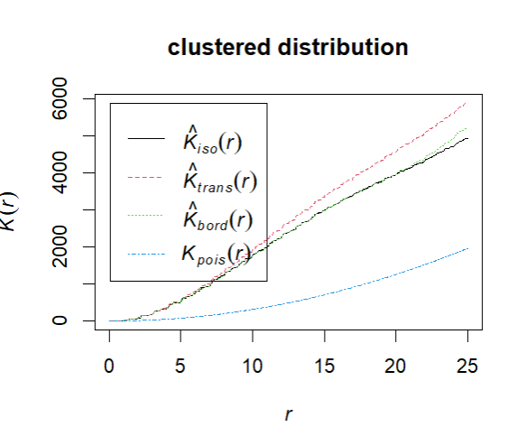
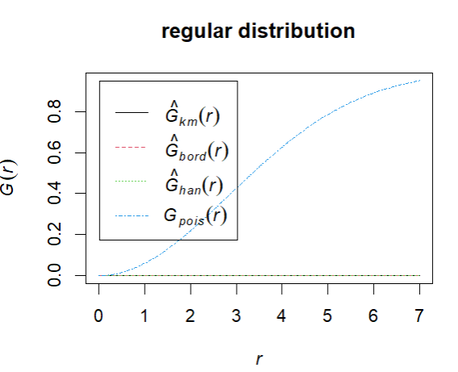

# iRamat
> R package development

Install from GitHub

```R
devtools::install_github("iramat/iRamat")
```

Load the `iRamat` package


```R
library(iRamat)
```

## Using the Database API

Connect the database API with the default parameters, and show the first row, using the `db_api_connect()` function

```R
df <- db_api_connect()
head(df$dataset_adisser17, 2)
```

Gives:


|site_name    | id_chips|sample_name |typology |   na|   mg|   al|    si|    p|    s| cl|    k|   ca|   mn|    fe|   loi| ag|  arsenic|     ba|     be|     bi|    cd|     ce|     co|    cr|    cs|     cu|     dy|     er|    eu| deltafe56| deltafe57|    ga|     gd|   ge|    hf|    ho| indium|    la| li|    lu|    mo|     nb|    nd|     ni| os|os187_os188 | os187_os186|       pb| pd|     pr|     rb| ru|     sb|     sc| se|     sm|    sn|     sr| sr87_sr86|    ta|    tb| te|    th|    ti| tl|    tm|     u|      v|     w|      y|     yb|     zn|     zr|major_method |major_analytical_setup                    |trace_method |trace_analytical_setup                    |reference                                                                                                                                                                                                                                                          |url                                                         |
|:------------|--------:|:-----------|:--------|----:|----:|----:|-----:|----:|----:|--:|----:|----:|----:|-----:|-----:|--:|--------:|------:|------:|------:|-----:|------:|------:|-----:|-----:|------:|------:|------:|-----:|---------:|---------:|-----:|------:|----:|-----:|-----:|------:|-----:|--:|-----:|-----:|------:|-----:|------:|--:|:-----------|-----------:|--------:|--:|------:|------:|--:|------:|------:|--:|------:|-----:|------:|---------:|-----:|-----:|--:|-----:|-----:|--:|-----:|-----:|------:|-----:|------:|------:|------:|------:|:------------|:-----------------------------------------|:------------|:-----------------------------------------|:------------------------------------------------------------------------------------------------------------------------------------------------------------------------------------------------------------------------------------------------------------------|:-----------------------------------------------------------|
|Aux Minières |     4967|MINHAO108-A |NA       | 0.04| 0.03| 3.23|  4.45| 0.04| 0.00|  0| 0.07| 0.09| 0.03| 53.17|  7.90| NA|  578.900|  20.31| 13.500|  0.308| 0.325|  56.06| 26.590| 214.9| 0.971|  5.587|  5.025|  2.637| 1.387|        NA|        NA| 7.478|  4.960| 2.61| 1.431| 0.938|  0.475| 21.24| NA| 0.372| 5.362|  2.808| 24.37| 63.140| NA|NA          |          NA| 113.8444| NA|  6.119|  4.692| NA| 127.50|  1.342| NA|  6.095| 0.945|  43.73|        NA| 0.227| 0.843| NA| 17.38| 0.092| NA| 0.397| 9.352|  857.3| 0.563|  22.17|  2.776| 112.60|  58.04|ICP-OES      |CRPG - Thermo Fisher Scientific Icap 6500 |ICP-OES      |CRPG - Thermo Fisher Scientific Icap 6500 |Alexandre Disser, Philippe Dillmann, Marc Leroy, Maxime L'Héritier, Sylvain Bauvais, Philippe Fluzin (2017), Iron Supply for the Building of Metz Cathedral: New Methodological Development for Provenance Studies and Historical Considerations, Archaeometry, 59 |https://onlinelibrary.wiley.com/doi/full/10.1111/arcm.12265 |


## Point Pattern and spatial analysis

### Point Pattern Analysis

The `ppa()` function performs different point pattern analysis (ppa) on raster. It could be used to assess if a point distribution is regular, clustered or random.

| regular | clustered | random |
|----------|----------|----------|
|  |  |  |

Run the function with its default parameters:

```R
d <- ppa()
```

`d` is an hash object (a Python dictionary-like) that stores different test outputs: Quadrat test, K-Ripley test, G-function test. Let's call some of these results:

#### Quadrat test

Check the Quadrat test of the clustered distribution

```R
d$clustered_distribution.png$quadrat
```

Gives:

```
	Chi-squared test of CSR using quadrat counts

data:  pp
X2 = 732.01, df = 24, p-value < 2.2e-16
alternative hypothesis: two.sided

Quadrats: 5 by 5 grid of tiles
```

#### K-Ripley test

```R
plot(d$clustered_distribution.png$ripley, main = "clustered distribution")
```

Gives:

<p align="center">
  
</p>

#### G-function test

```R
plot(d$regular_distribution.png$gfunction, main = "regular distribution")
```

Gives:

<p align="center">
  
</p>


